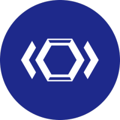
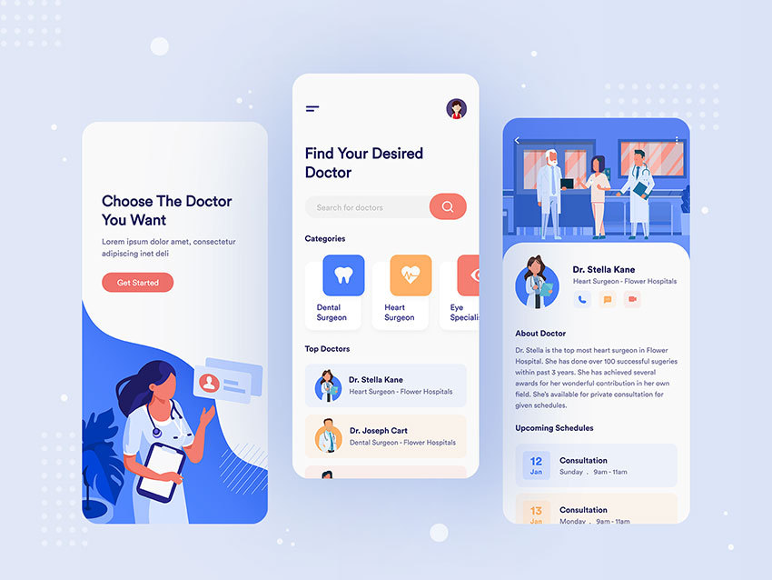

# Doctor Consultation App - Mobile UI 
To view the site online it is available here [deploy link](https://doctor-consultation-app.netlify.app/)
## About the project
The project was done within the TomorrowDevs mentoring course and consists of replicating the mobile UI of the Doctor Consultation app using an OOP development methodology.

### Built With
- Javascript ES6
- Webpack
- Sass
- EJS

## Requirement

The goal of this project is to recreate the UI made in Figma using flexbox and adding animations / transitions.
The following are the requirements to be met:
* Respect exactly the provided layout
* If visiting the page on a Desktop, show an alert to the user that says to check the same page from a Mobile Device
* Provide the Mobile experience of Scrolling and Navigation of Details
* Details of the Doctors are mocked (e.g. No API is needed)
* The search input should filter the doctors by name
* Each Category should filter the doctors
* By clicking on a Doctor name, the user should see the details
* Test the layout on a real mobile device (check Browsersync for this)
* Deploy the project towards Netlify (www.netlify.com) connected to your GitHub Repo
* After the project is deployed, analyze it with https://web.dev

## Tasks executed
* Recreate the static layout css class (index, getstarted page and doctor page)
* Add alert for desktop view 
* Upload json doctors and categories data
* Create doctor and categories class
* Add webpack 
* Realize the search function doctor 
* Realize the filter function for categories section
* Analyze and test the proper functioning of the app with and without Browsersync

### Refactoring Tasks
* Use only ES6
* Reorganize files/folders
* Refactoring readme
* Add templating (ejs/hadnlebars)

### Contributing
Contributions are what make the open source community such an amazing place to learn, inspire, and create. Any contributions you make are greatly appreciated.

- Fork the Project
- Create your Feature Branch (git checkout -b feature/AmazingFeature)
- Commit your Changes (git commit -m 'Add some AmazingFeature')
- Push to the Branch (git push origin feature/AmazingFeature)
- Open a Pull Request